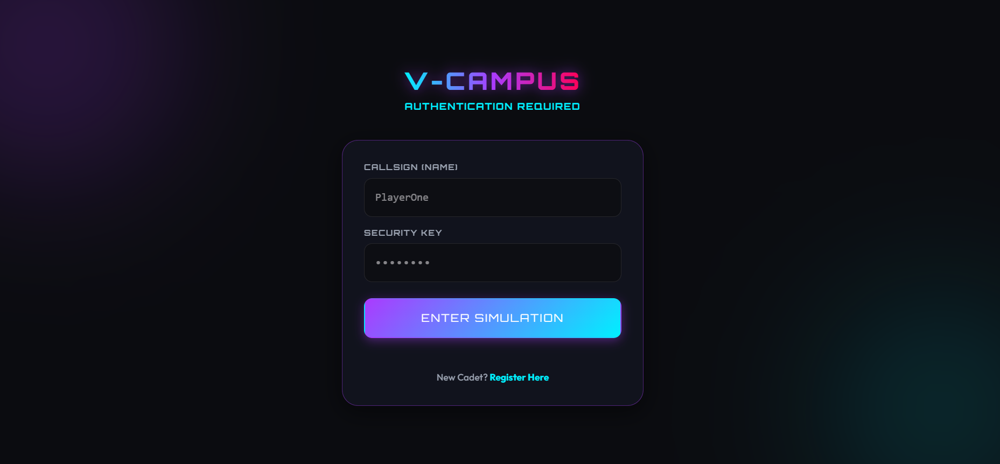
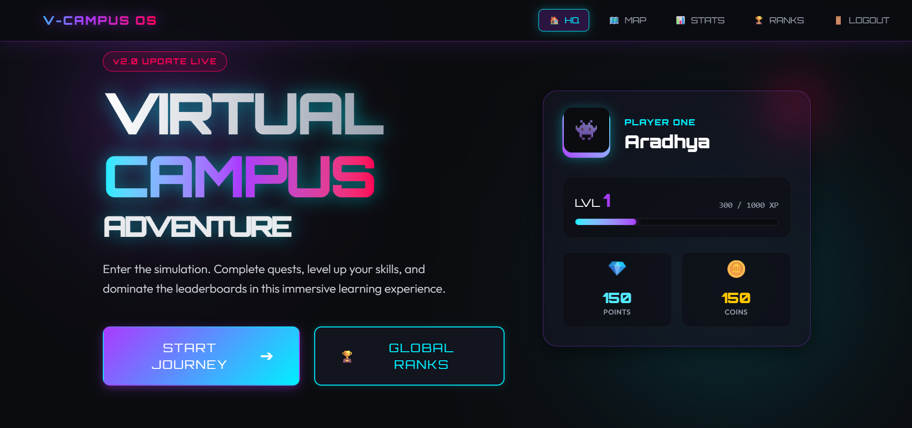
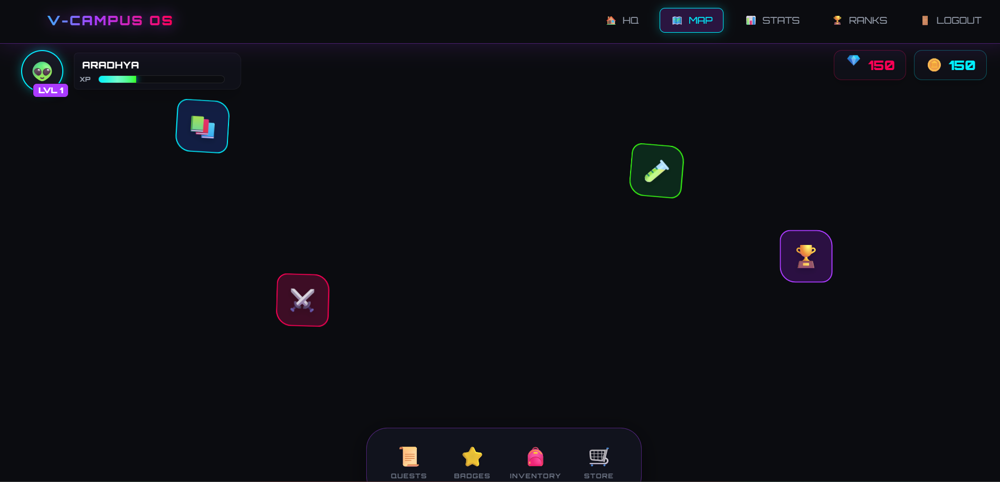
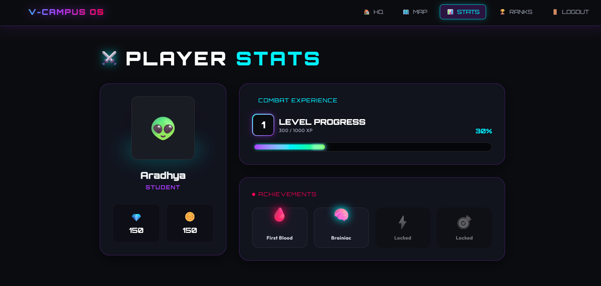

# 🎮 Virtual Campus

A gamified virtual learning platform inspired by RPG games where students complete quests, gain experience points, unlock achievements, explore an interactive campus map, and compete on leaderboards.

---

## Features

- 🔐 JWT Authentication
- 👤 Player Profile & Progress
- 🗺️ Interactive Campus Map
- 🎯 Quest & Task System
- 🏆 Leaderboards
- ⭐ Achievement & Badge System
- 📊 Player Statistics Dashboard
- 💎 Coins & XP System
- 📱 Responsive UI
- ⚡ REST API Backend

---

## Tech Stack

### Frontend
- React
- Vite
- CSS

### Backend
- Node.js
- Express.js
- MongoDB
- JWT Authentication
- REST APIs

---

## Project Structure

```
VIRTUAL_CAMPUS
│
├── frontend
└── backend
```

---

## Screenshots

### Login



### Home



### Campus Map



### Dashboard



---

## Installation

### Backend

```bash
cd backend
npm install
npm run dev
```

### Frontend

```bash
cd frontend
npm install
npm run dev
```

---

## Environment Variables

Backend

```
MONGO_URI=
JWT_SECRET=
PORT=
```

Frontend

```
VITE_API_URL=
```

---

## Future Improvements

- Multiplayer Campus
- Live Chat
- AI Quest Generator
- Event Calendar
- Notifications
- Admin Dashboard

---

## Author

**Aradhya Agarwal**